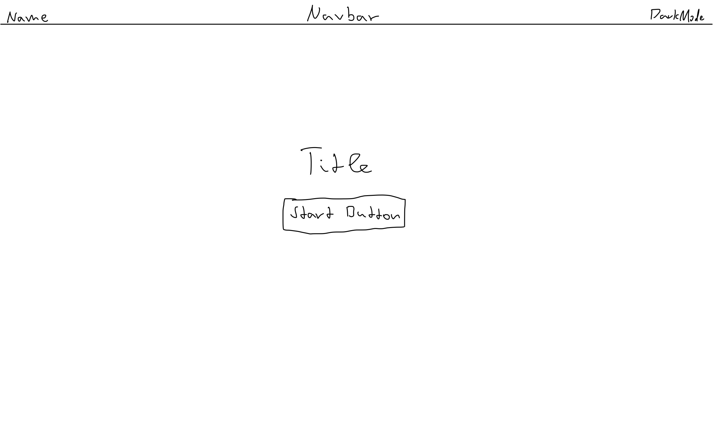
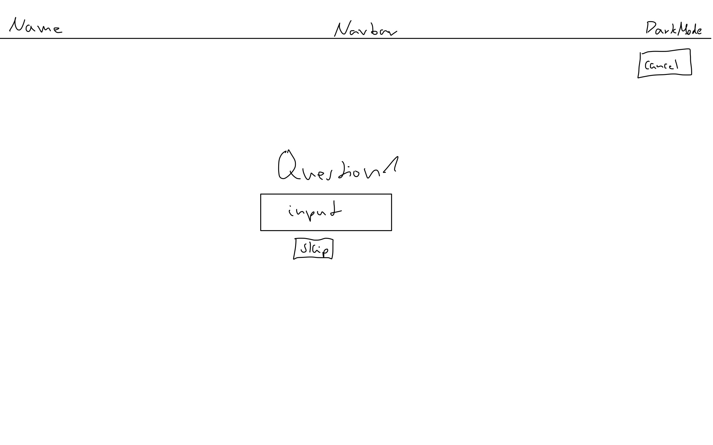
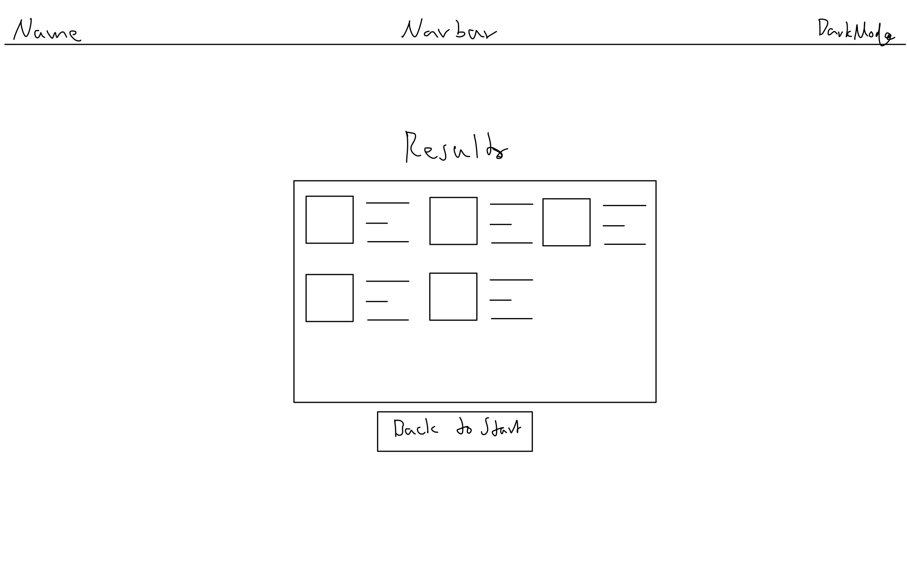

## Ideas

- Zweck der App ist, Geschenkideen zu bekommen nachdem man einige Informationen über eine Person eingibt.
- In der Startseite ist zunächst ein button zu sehen der den Vorgang startet in dem der User befragt wird.
  Also in welcher Beziehung steht der User zur Person, wie alt ist die Person, männlich oder weiblich, Interessen, aktuelle Lage usw.
- Der User kann die Fragen beantworten, überspringen oder den ganzen Prozess jederzeit beenden.
- Am Ende bekommt der User Geschenke mit Bildern, infos und ein Amazon Buy Link vorgeschlagen. Bedeutet du musst die API von OpenAI mit einer Amazon API oder ähnlicher kombinieren
- OpenAI gibt dir die Vorschläge, also die Geschenke, und du musst dann mit der Amazon API nach den Vorschlägen suchen bzw. Daten über die Geschenke/Produkte bekommen.

## Designs

